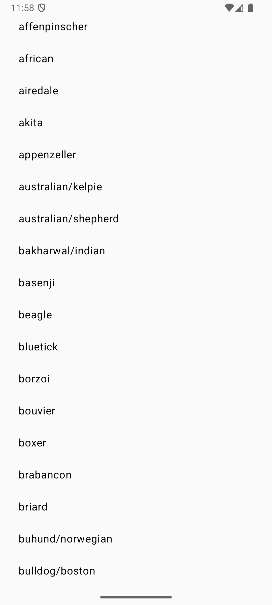

# Dog Breeds Explorer

Dog Breeds Explorer is a simple Android app built with **Jetpack Compose** that displays a list of dog breeds (and sub-breeds) using the [Dog CEO API](https://dog.ceo/dog-api/documentation/). Selecting a breed navigates to a screen displaying random images of that breed.

## Screenshots

  
  

